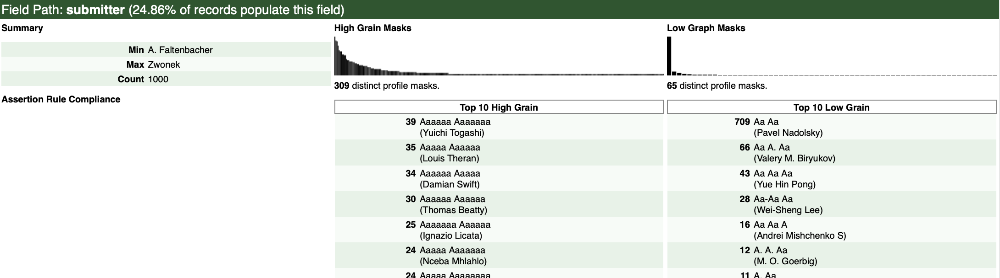

# Profile and Generate a DQ Report on a sample of ArXiv Metadata

The full source of this example can be found here:

[src/main/scala/uk/gov/ipt/das/dataprofiler/example/ProfileArxivMetadata.scala](src/main/scala/uk/gov/ipt/das/dataprofiler/example/ProfileArxivMetadata.scala)

## Overview

This example creates a data quality report, which returns results for each
unique field in the dataset, looking like this:


Each field has a section showing the histogram of the high and low graph
masks, with some summary data, like this:



## Data Source

ArXiv is an open access repository of scientific research papers. We are using
its metadata as an example of a real-life data source, and also because its
metadata has a license which means we can redistribute it here.

We have taken the first 1000 records, which are here:

[src/main/resources/arxiv/arxiv-top1000.jsonl](src/main/resources/arxiv/arxiv-top1000.jsonl)

## Set up Spark

First we must create a Spark session, which can be done locally:

```
val spark: SparkSession = {
  val sparkSession = SparkSession
    .builder()
    .master("local[8]")
    .appName("spark session")
    .config("spark.default.parallelism", "8")
    .config("spark.sql.shuffle.partitions", "8")
    .getOrCreate()

  sparkSession.sparkContext.setLogLevel("OFF")
  sparkSession
}
```

This code initialises a spark session using a local master, and parallelisation
set to 8 - i.e. if you have a 4 core processor with hyperthreading this will
max it out - for this small set of sample data this won't matter, however.

We also turn off some of the logging.

## Load JSON and parse into RecordSets

Next we load the JSONL file from the source file and parse into a
`RecordSets` object:

```
val jsonLines =
  IOUtils.readLines(getClass.getClassLoader.getResourceAsStream("arxiv/arxiv-top1000.jsonl"), StandardCharsets.UTF_8).asScala

val recordSets =
  RecordSets("arxiv-top1000" -> FlattenedRecords(fromJsonStrings(spark, jsonLines, idPath = Option("id"))))
```

We specify that the ID can be found in the `id` field, otherwise defaults
are used for everything. Note that we do not need to specify the schema of the
JSON at all, and it is OK to mix and match schemas across the records.

## Profile the records

We use a ProfilerConfiguration to specify the rules:

```
val results =
  ProfilerConfiguration(
    recordSets = recordSets,
    rules = FieldBasedMask() // uses default masks
  ).executeMulti()
```

In this example we use the defaults that come with `FieldBasedMask()`, which
simply performs `HighGrainProfile()` and `LowGrainProfile()`.

The `executeMulti()` option runs the profiler on each RecordSet individually
and returns the results paired with the ID of the recordset.

In this example there is only one recordset, with the id of `"arxiv-top1000"`.

## Analyse the Profiler Results

Next we loop over the datasets (there is only one in this example),
print out the first 1000 rows of the profiler results to see what they look
like, and then generate a human-readable report using the built-in template:

```
results.foreach { case (_, profileRecords) =>

  // output the top 1000 lines of the results metrics
  profileRecords.getMetrics().dataFrame.foreach { metricsDataframe =>
    // show some metrics
    metricsDataframe.show(numRows = 1000, truncate = false)
  }

  // create a report and open it using system browser
  MetricsReport.generateReportTemplate(profileRecords.getMetrics()).map { metricsValues =>

    // fill in the template values from the metrics dataframe
    val reportTemplateValues = BasicReportTemplate(
      title = s"ArXiv metadata Data Quality Report",
      date = LocalDate.now().toString,
      sources = SourceInfo.fromRecordSets(recordSets),
      rows = metricsValues.toArray
    )

    // generate the HTML from the built-in template
    val reportStr = BasicReport().generateHTML(reportTemplateValues)

    // write the HTML to a temporary file
    val tmpHtmlFile = Files.createTempFile(s"metrics-report-arxiv", ".html").toFile
    val fw = new FileWriter(tmpHtmlFile)
    fw.write(reportStr)
    fw.close()

    println(s"Written HTML to ${tmpHtmlFile.getAbsolutePath}")

    // open using the system browser
    Desktop.getDesktop.open(tmpHtmlFile)
  }
}
```

To generate a report, we first generate the template values using this line:

`MetricsReport.generateReportTemplate(profileRecords.getMetrics())`

This calculates the metrics from the results, and we fill in the complete
template values set using this block:

```
val reportTemplateValues = BasicReportTemplate(
      title = s"ArXiv metadata Data Quality Report",
      date = LocalDate.now().toString,
      sources = SourceInfo.fromRecordSets(recordSets),
      rows = metricsValues.toArray
    )
```

Note that we can customise the title here. It is also possible to customise
the logo used, and other parameters.

We generate the HTML on this line:

`val reportStr = BasicReport().generateHTML(reportTemplateValues)`

Note that we can also instead use the `generateRedactedHTML()` to create
a version of the report that does not include sample values, useful if the
source data contains PII or other sensitive information.

We then write the HTML to a temporary file, and open it in the system browser.