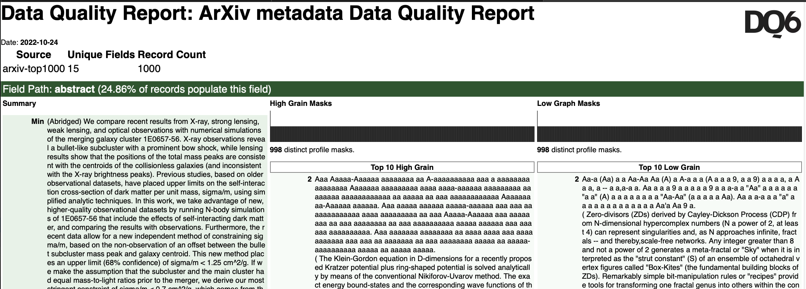

# DAS Data Profiler Examples

This repository contains example uses of the DAS Data Profiler.

## Profile and Generate a DQ Report on a sample of ArXiv Metadata

[Profile Arxiv Metadata](ProfileArxivMetadata.md)

Profile a dataset, and create a data quality report from a JSON data source,
that looks like this:

## Configure Custom Profile Masks

[Custom Profile Masks](CustomProfileMasks.md)

Create a custom profile mask, run it on a dataset, and analyse the output to
trace some potential data quality issues.

## Configure and Create Assertion Rules to run in the Data Profiler

[Configure Assertion Rules](ConfigureAssertionRules.md)

Create some assertion rules to run over the data source, and some to run over
specific fields. Pass and failure rates are visualised in the report output,
like this:

// TODO add image

## Adding Reference Data

TBC: ONS Postcodes walkthough

Licensed under the MIT License, see [LICENSE](LICENSE)

